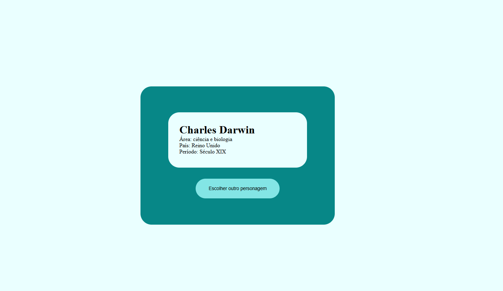

# 📌 Mentis

Sorteio aleatório de personagens da história importantes para a arte, cinema, música, política, etc para que você possa pesquisar sobre e ampliar o seu leque de comunicação.

<br>

## 🚀 Tecnologias utilizadas

* HTML 5
* CSS 3
* TypeScript
* React
* Vite

<br>

## 🎯 Funcionalidades

* [ ] Sorteio aleatório de pessoas importantes da história

<br>

## 📸 Preview



<br>

## 👤 Como interagir com o projeto

Acesse o [Link](https://mentis-lemon.vercel.app/) 

<br>

## ⚙️ Como rodar o projeto

```bash
# Clonar o repositório
git clone https://github.com/andressatomiozzo/mentis.git

# Instalar dependências
npm install

# Rodar o projeto
npm run dev
```

<br>


## 🧠 Aprendizados

* Trabalhar com estado no React
* Manipulação de DOM
* Consumo de API
* Organização de código

<br>

## 🛠️ Melhorias futuras

* [ ] Integração com backend para que seja possível realizar login e comentários sobre o tópico.

<br>

## 📄 Licença

Este projeto está sob a licença MIT.

<br>

# ⭐ Contribuição

Sinta-se livre para contribuir, abrir issues ou sugerir melhorias para o projeto.